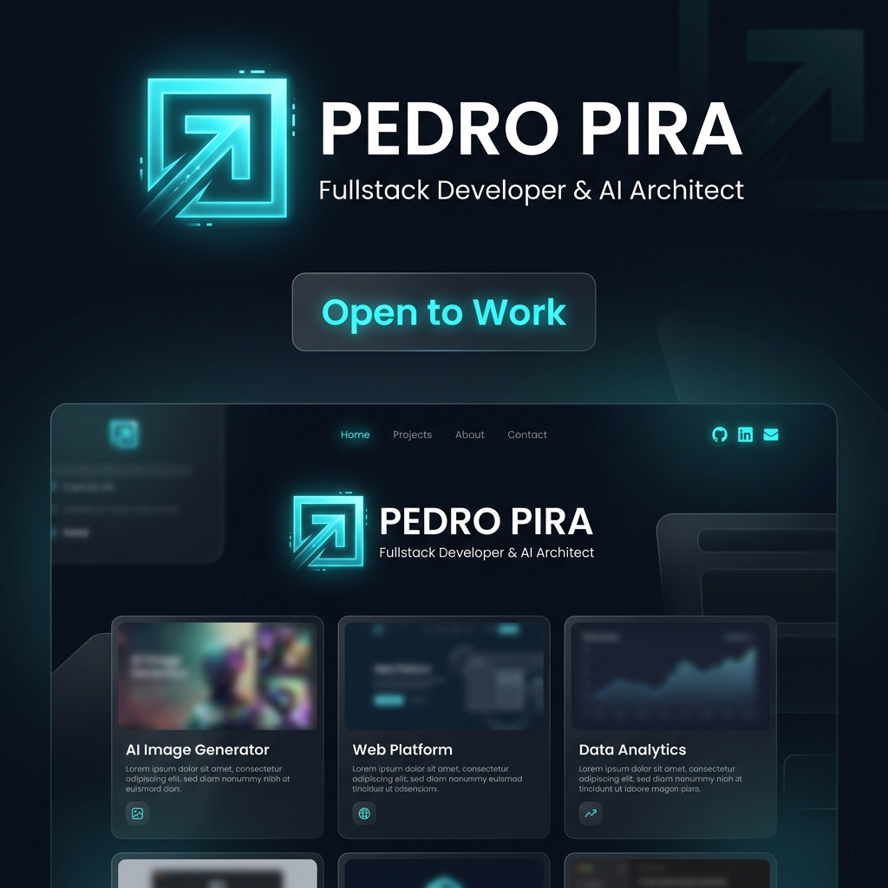

# Pedro Pira - Fullstack Developer & AI Architect

> "No solo solucionar problemas, crear soluciones."

Bienvenido al repositorio de mi portafolio personal interactivo, desarrollado bajo la filosofía **AI First** y **Spec-Driven Development (SDD)**. Este proyecto no es solo una tarjeta de presentación, sino una demostración viva de mi enfoque en la arquitectura técnica, el diseño moderno y la integración de IA en el desarrollo web.

## 🚀 Tecnologías Principales

- **Framework:** Next.js 14+ (App Router)
- **Lenguaje:** TypeScript
- **Estilos:** Tailwind CSS
- **Animaciones:** Framer Motion
- **Arquitectura:** Spec-Driven Development (SDD) & Hexagonal / Clean Architecture concepts
- **Despliegue:** Vercel https://pedropiradev.vercel.app

## 🏗️ Estructura del Proyecto

El proyecto está diseñado con un enfoque modular y escalable:

- `src/components/sections/`: Secciones principales de la landing page (Hero, About, Skills, Experience, Mentors, Contact).
- `src/components/ui/`: Componentes reutilizables de la interfaz (GlassCard, FloatingActions, IntroLoader).
- `src/data/`: Datos centralizados en TypeScript para fácil actualización (Mentores, Skills, Experiencia).
- `src/app/`: Rutas, layouts y metadata (App Router de Next.js).

## 🌟 Características Destacadas

1. **Diseño "Glassmorphism" Premium:** Uso avanzado de Tailwind CSS para crear interfaces translúcidas, gradientes sutiles y un aspecto de "Centro de Comando".
2. **Sistema de Animaciones:** Interacciones fluidas, transiciones de sección y micro-animaciones (hovers, loaders, botones flotantes) impulsadas por Framer Motion.
3. **UX Estratégica:** 
   - **Floating Actions:** Botones de WhatsApp y Descarga de CV que siguen al usuario pero se ocultan de forma inteligente al llegar a la sección de contacto mediante `IntersectionObserver`.
   - **Contacto de Alta Conversión:** Efectos personalizados (como el estilo Gmail al hacer hover) y llamadas a la acción directas.
4. **Linaje Técnico (Mentores):** Una sección única que da crédito a las influencias que han moldeado mi filosofía de trabajo y arquitectura.

## 🤝 Contacto

¿Listo para desafiar los límites de la ingeniería juntos?

- **WhatsApp Directo:** [+57 311 4846947](https://wa.me/573114846947)
- **LinkedIn:** [Pedro Pirachican](https://linkedin.com/in/pedropirachican)

---
*Diseñado y construido con precisión técnica y mentalidad de arquitecto.*
